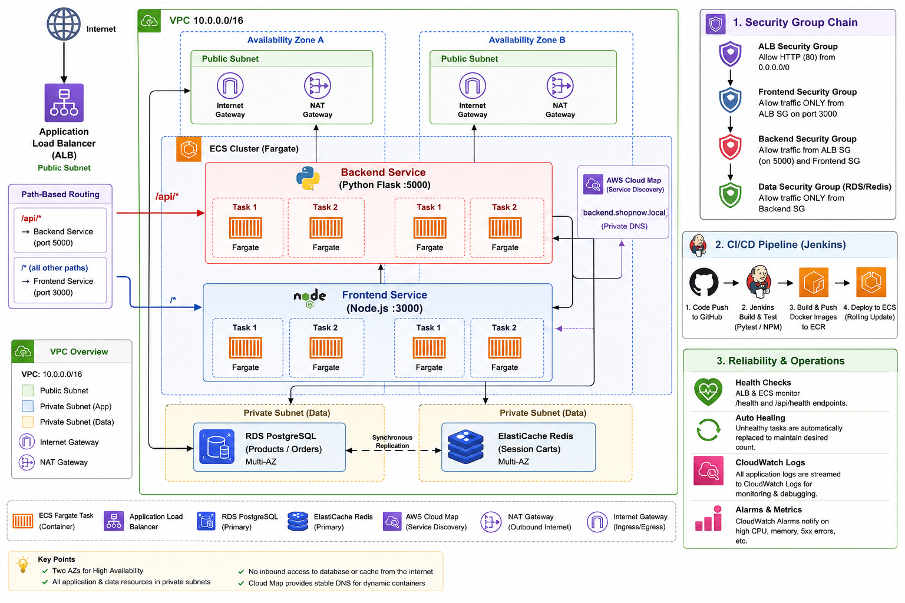

# ShopNow — ECS Fargate Microservices Deployment

A cloud-native e-commerce application demonstrating modern DevOps practices: containerisation, Infrastructure as Code, load balancing, service discovery, and resiliency testing on **Amazon ECS Fargate**.

---

## Architecture



**Stack**: Node.js · Python Flask · PostgreSQL · Redis · Docker · Terraform · AWS ECS Fargate · ALB · ECR · Cloud Map · Jenkins

---

## Project Structure

```
.
├── app/
│   ├── frontend/          # Node.js / Express frontend (port 3000)
│   │   ├── Dockerfile
│   │   ├── server.js      # API proxy + static file server
│   │   ├── package.json
│   │   └── public/
│   │       └── index.html # Single-page storefront
│   ├── backend/           # Python Flask REST API (port 5000)
│   │   ├── Dockerfile
│   │   ├── app.py         # Products (PostgreSQL) + Cart (Redis)
│   │   └── requirements.txt
│   └── docker-compose.yml # Local 4-service stack
│
├── Jenkinsfile            # Declarative CI/CD pipeline (test → build → push → deploy)
│
├── jenkins/               # Local Jenkins setup
│   ├── Dockerfile         # Jenkins LTS + Docker CLI + AWS CLI + Python + Node
│   ├── plugins.txt        # Pre-installed plugin list
│   └── docker-compose.yml # Run Jenkins locally for pipeline development
│
├── terraform/             # All AWS infrastructure (Terraform ≥ 1.6)
│   ├── main.tf            # Root module — wires all child modules together
│   ├── variables.tf       # Root input variables
│   ├── outputs.tf         # Root outputs (ALB URL, ECR URIs, Jenkins URL, etc.)
│   ├── terraform.tfvars.example
│   └── modules/
│       ├── networking/    # VPC, subnets, IGW, NAT GW, route tables
│       ├── security/      # Security groups for ALB, ECS, RDS, Redis
│       ├── ecr/           # ECR repositories + lifecycle policies
│       ├── alb/           # ALB, target groups, listener rules
│       ├── ecs/           # Cluster, IAM, CloudWatch, Cloud Map, task defs, services
│       ├── rds/           # RDS PostgreSQL 16
│       ├── elasticache/   # ElastiCache Redis 7
│       └── jenkins/       # Jenkins EC2 (optional, toggled by jenkins_enabled)
│
├── ecs/
│   ├── task-definitions/  # Standalone task def JSON (for CLI / reference)
│   └── services/          # Standalone service JSON (for CLI / reference)
│
└── docs/
    ├── architecture.md    # Detailed architecture + networking
    ├── deployment.md      # Step-by-step deployment guide
    ├── cicd.md            # Jenkins CI/CD pipeline guide
    └── resiliency-test.md # Fault tolerance demo scripts
```

---

## Quick Start — Local Development

```bash
cd app
docker compose up --build
```

| Service | URL |
|---------|-----|
| Storefront | http://localhost:3000 |
| Backend API | http://localhost:5000/api/products |
| Health check | http://localhost:5000/api/health |

---

## Deploy to AWS

### 1. Configure Terraform

```bash
cd terraform
cp terraform.tfvars.example terraform.tfvars
# Edit terraform.tfvars — set your db_password at minimum
```

### 2. Create ECR repositories + base infra

```bash
terraform init
terraform apply -target=module.ecr -auto-approve
```

### 3. Build and push images

```bash
ACCOUNT=$(aws sts get-caller-identity --query Account --output text)
REGION=us-east-1

aws ecr get-login-password --region $REGION \
  | docker login --username AWS --password-stdin ${ACCOUNT}.dkr.ecr.${REGION}.amazonaws.com

docker build -t ${ACCOUNT}.dkr.ecr.${REGION}.amazonaws.com/shopnow-dev-frontend:latest ./app/frontend
docker build -t ${ACCOUNT}.dkr.ecr.${REGION}.amazonaws.com/shopnow-dev-backend:latest  ./app/backend

docker push ${ACCOUNT}.dkr.ecr.${REGION}.amazonaws.com/shopnow-dev-frontend:latest
docker push ${ACCOUNT}.dkr.ecr.${REGION}.amazonaws.com/shopnow-dev-backend:latest
```

### 4. Deploy everything

```bash
terraform apply -auto-approve
terraform output alb_url   # Open this in your browser
```

---

## API Reference

| Method | Path | Description |
|--------|------|-------------|
| GET | `/api/health` | Service health + dependency checks |
| GET | `/api/products` | List all products |
| GET | `/api/products/<id>` | Single product |
| GET | `/api/cart/<session>` | Get cart (Redis) |
| POST | `/api/cart/<session>` | Add item to cart |
| DELETE | `/api/cart/<session>` | Clear cart |

---

## CI/CD with Jenkins

The `Jenkinsfile` at the project root defines a declarative pipeline:

```
Test (parallel) → Build Images → Push to ECR → Deploy Backend → Deploy Frontend
```

**Quick start (local):**
```bash
cd jenkins
docker compose up --build -d
# Open http://localhost:8080
```

**On AWS** — set `jenkins_enabled = true` in `terraform.tfvars` and run `terraform apply`. Jenkins deploys on EC2 and uses its IAM instance profile for AWS access — no credentials to configure in Jenkins.

See [docs/cicd.md](docs/cicd.md) for the full setup guide.

---

## Documentation

- [Architecture](docs/architecture.md) — VPC layout, security groups, service discovery
- [Deployment Guide](docs/deployment.md) — Step-by-step deployment instructions
- [CI/CD Pipeline](docs/cicd.md) — Jenkins pipeline setup and usage
- [Resiliency Testing](docs/resiliency-test.md) — Fault tolerance demo

---

## Teardown

```bash
cd terraform
terraform destroy -auto-approve
```

---

## Key Design Decisions

| Decision | Rationale |
|----------|-----------|
| ECS Fargate | No control-plane fee, no node management, faster time-to-deploy |
| Private subnets for tasks | Tasks are not directly reachable from the internet |
| Cloud Map service discovery | Avoids hardcoded IPs between services |
| ALB path-based routing | Single entry point — `/api/*` → backend, `/*` → frontend |
| Deployment circuit breaker | Automatic rollback when new tasks fail health checks |
| Multi-AZ | Two AZs for frontend and backend ensure availability during AZ failures |
| Jenkins IAM instance profile | No AWS credentials stored in Jenkins — role-based access only |
| Backend deploys before frontend | Ensures API stability before the UI rolls out |
